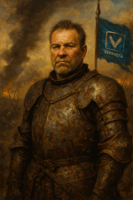
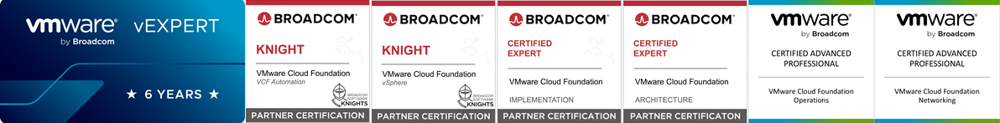

+++
date = '2026-03-19T12:42:12+01:00'
draft = false
title = 'About Me'
+++

Bits and bytes fascinated me even as a child. On some weekends, my father and I would sit together poring over lines of code that were still printed out on paper. 

By the time I made my first attempts at programming on the VC-20, my passion for IT was fully ignited. After graduating from technical college, I first worked as an office equipment technician and later as a systems engineer, where I had the opportunity to actively shape rapid technological advancements for various clients. 

Today, as a Solution Architect for Software-Defined Datacenters, I am responsible for the entire technical spectrum of VMware by Broadcom solutions.
Training and continuing education also play an important role in this, as it is precisely this expertise that forms the indispensable foundation for sustainable success.

