# Prerequisites:

- Installed vSphere environment

- Binaries are downloaded from
  [https://support.broadcom.com](https://support.broadcom.com/group/ecx/productfiles?subFamily=VMware%20vSphere%20Foundation&displayGroup=VMware%20vSphere%20Foundation%209&release=9.0.2.0&os=&servicePk=537838&language=EN)

- vCenter version at least 9.0.x

## 

# Start the Installation process

- Connect to your vCenter UI, go to "Inventory", right-click on your
  cluster and select "Deploy OVF Template..."

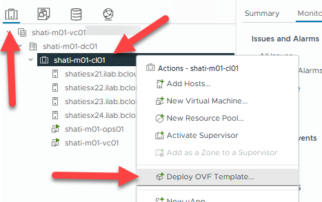

- In the "Select an OVF template" screen, select "Local file" and click
  "UPLOAD FILES"

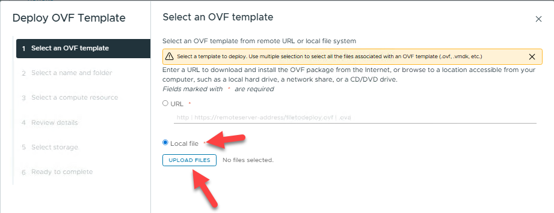

- Within the file browser, select your downloaded OVA file and click
  "Open"

 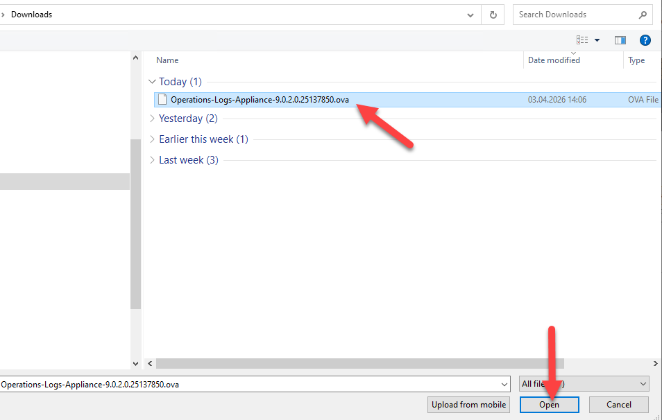

- Proceed with "NEXT"

 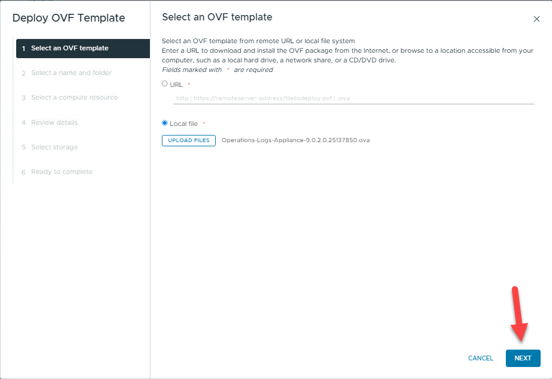

- Give the new VM a name, a location and proceed with "NEXT"

 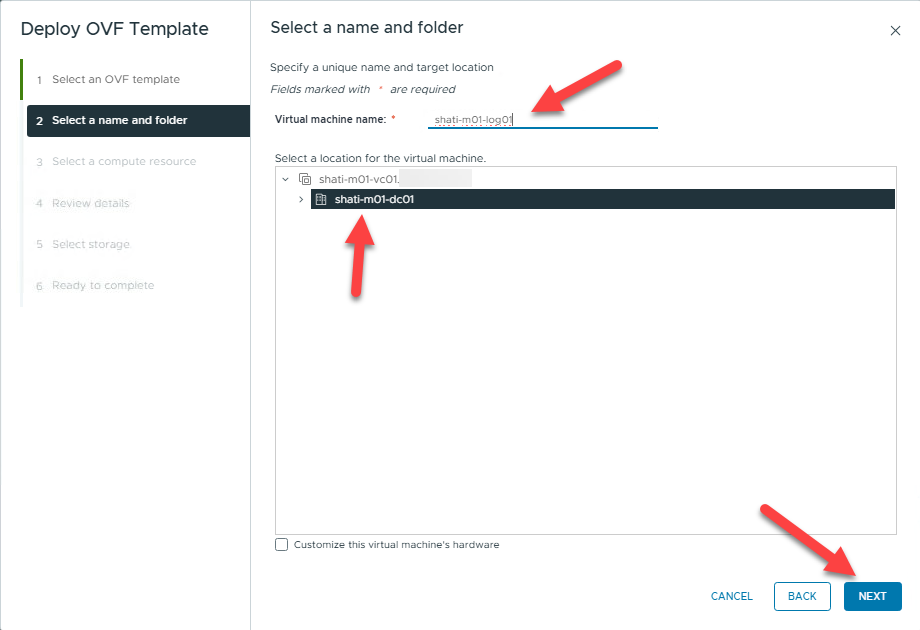

- Select a compute resource (host or cluster) and click "NEXT"

 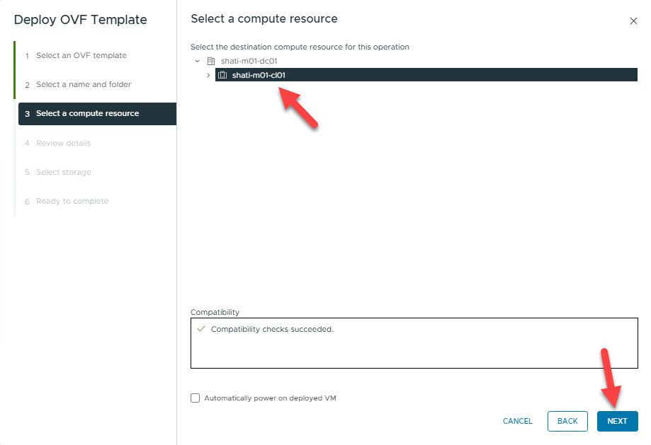

- Ignore the certificate warning and click "NEXT"

 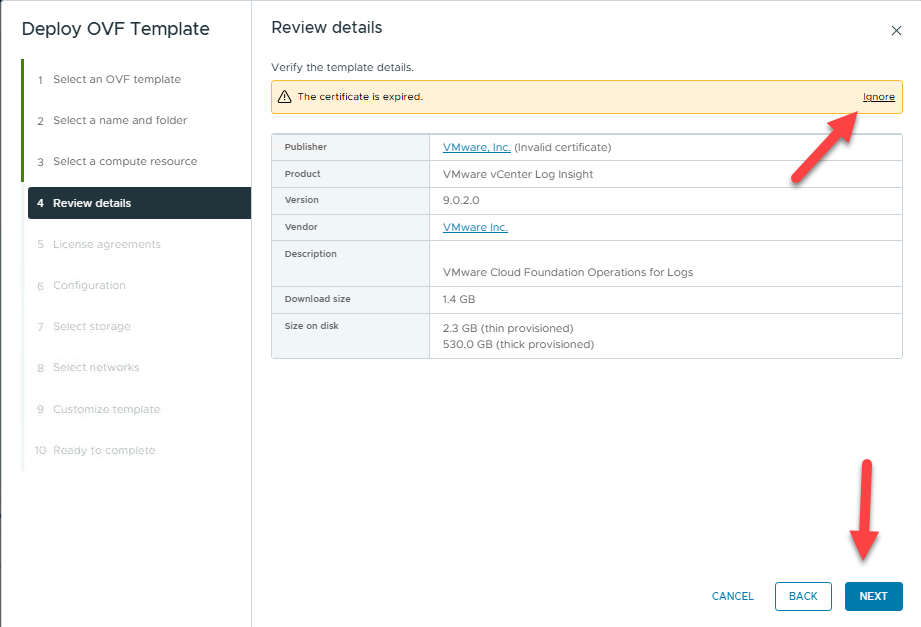

- Accept the license agreement and click "NEXT"

 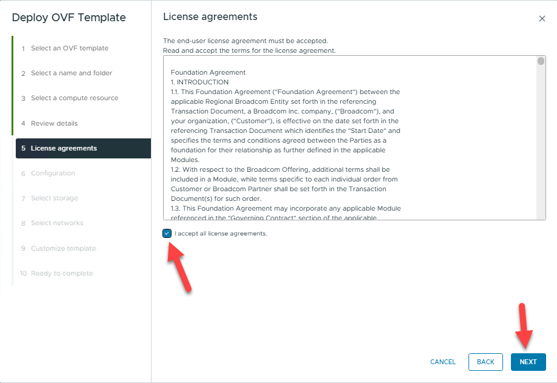

- Configure the appliance size and click "NEXT" but keep in mind that
  you should use at least "medium" for production environments.

 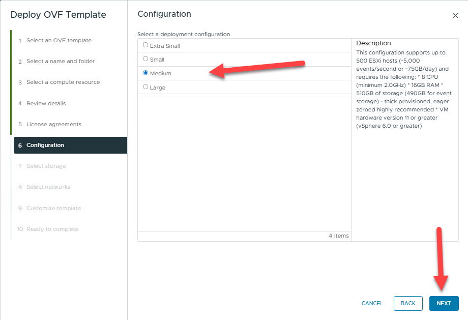

- Configure the storage placement for your log appliance and proceed
  with "NEXT".

 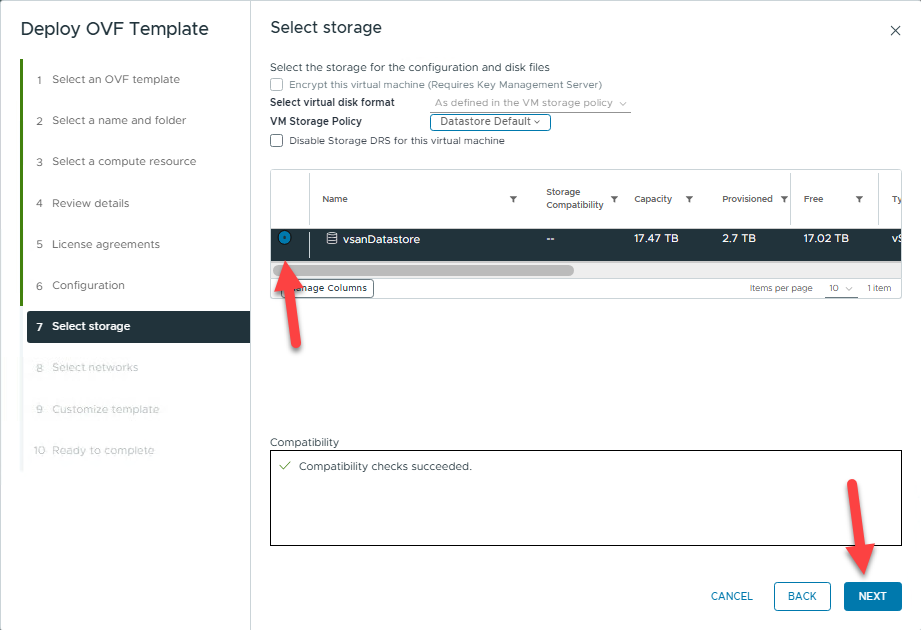

- Customize the virtual network your VM should run on.

 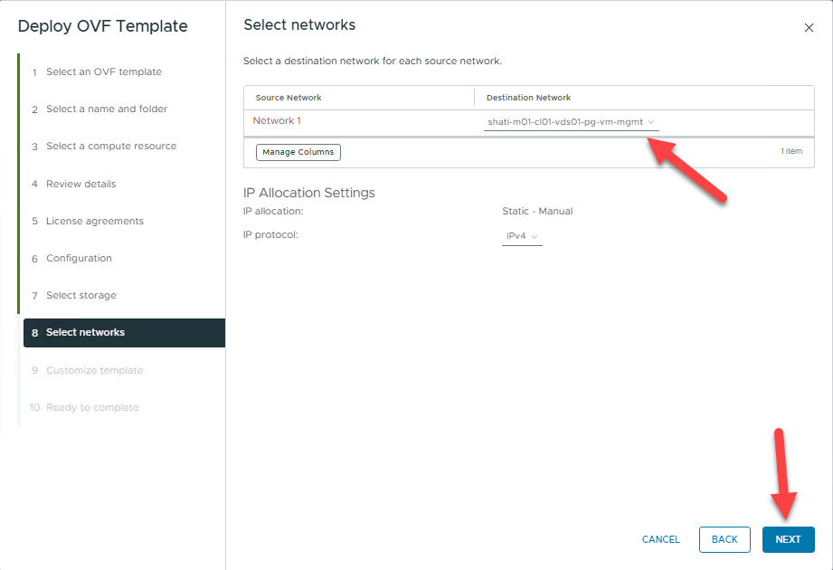

- Customize additional settings for the appliance and proceed with
  "NEXT".

  - **Initial root password** - This will be used as an initial password
    for the root user account.

  - **Hostname** - The hostname or the fully qualified domain name for
    this VM. Leave blank if DHCP is desired.

  - **Default Gateway** - The default gateway address for this VM. Leave
    blank if DHCP is desired.

  - **Domain Name** - The domain name of this VM. Leave blank if DHCP is
    desired.

  - **Domain Search Path** - The domain search path (comma or space
    separated domain names) for this VM. Leave blank if DHCP is desired.

  - **Domain Name Servers** - The domain name server IP Addresses for
    this VM (comma separated). Leave blank if DHCP is desired

  - **Network 1 IP Address** - The IP address for this interface. Leave
    blank if DHCP is desired.

  - **Network 1 Netmask** - The netmask or prefix for this interface.
    Leave blank if DHCP is desired.

 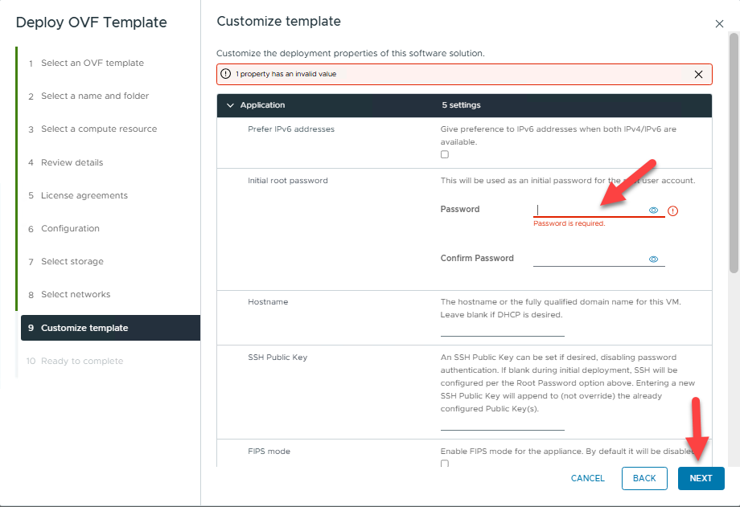

- Review the summary and click "FINISH"

 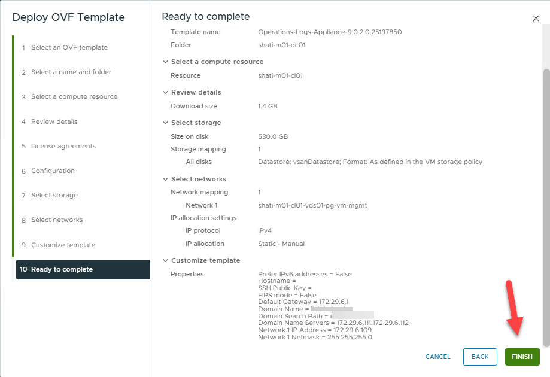

 Wait for the deployment to be completed.

- Power on the VM and connect to the URL.

 On the initial SETUP, click "NEXT" to start the process.

 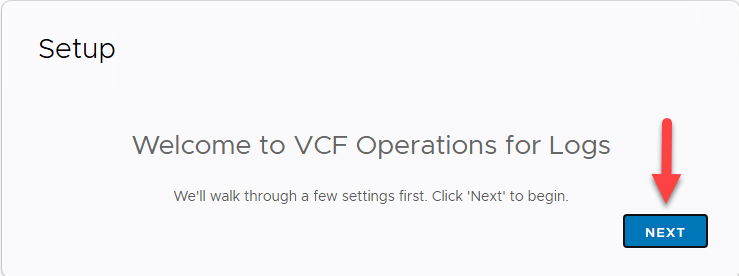

- On the next screen you can choice to start a new deployment or join an
  existing one. In our case, we start a new deployment.

 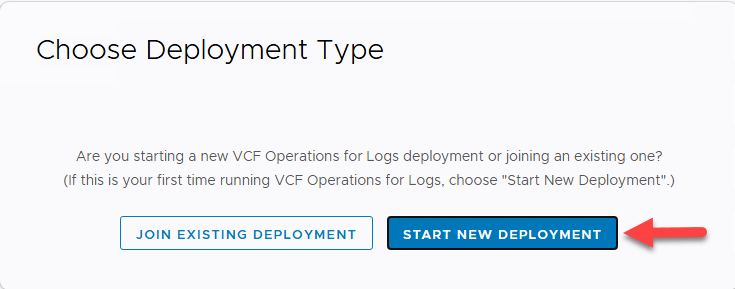

 Wait for the initial configuration to be completed.

 

 After a couple of minutes, you must specify the admin credentials.

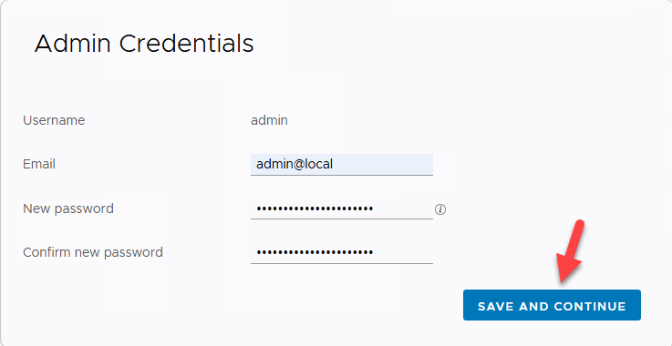

 Specify your mail server or your http post system, leave blank if you
 want to do this later

 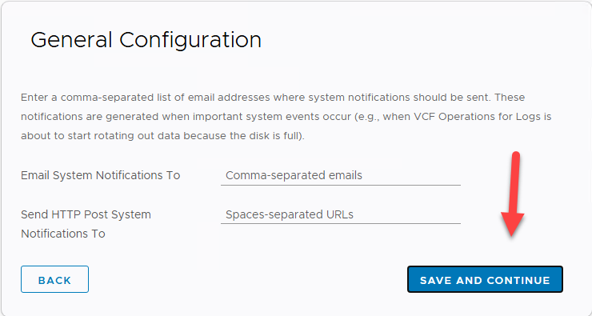

 Correct time is essential, so configure your time source.

 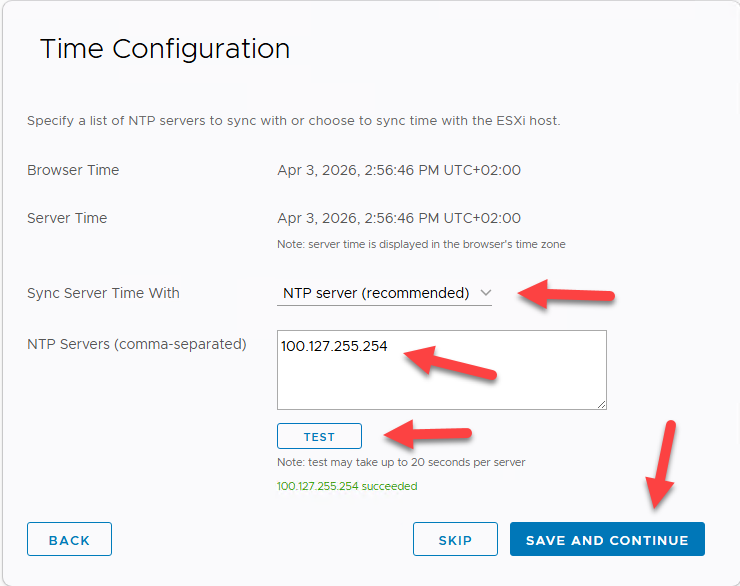

 I do not have a SMTP server ready, so I will skip that, but you can
 configure SMTP if you want to.

 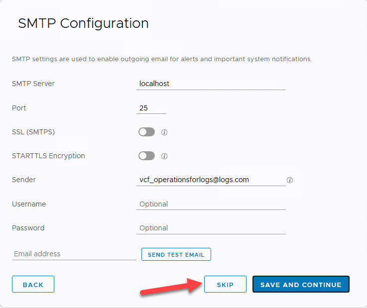

 You can change the SSL certificate right now, I am fine with the
 default self-signed certificate so I will skip that.

 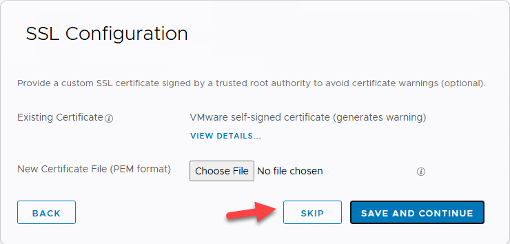

 Select "FINISH" to end the initial setup wizard.

 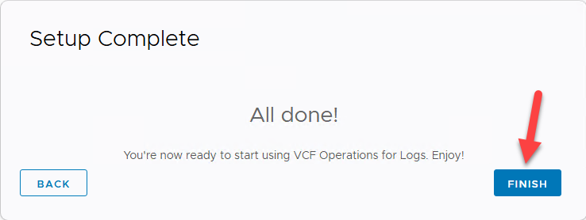

 After clicking "FINISH" you have to integrate VCF Operations for Logs
 with your vSphere environment.

- To configure vSphere Integration click on "Configure vSphere
  integration »"

 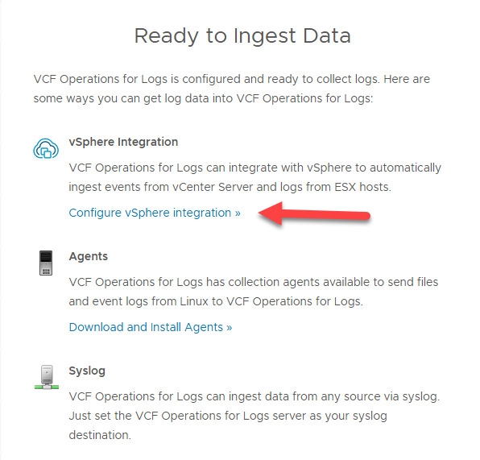

- On the upper right corner, select "ADD VCENTER SERVER"

 Provide the following information then click "TEST CONNECTION" and if
 successful, click "SAVE"

 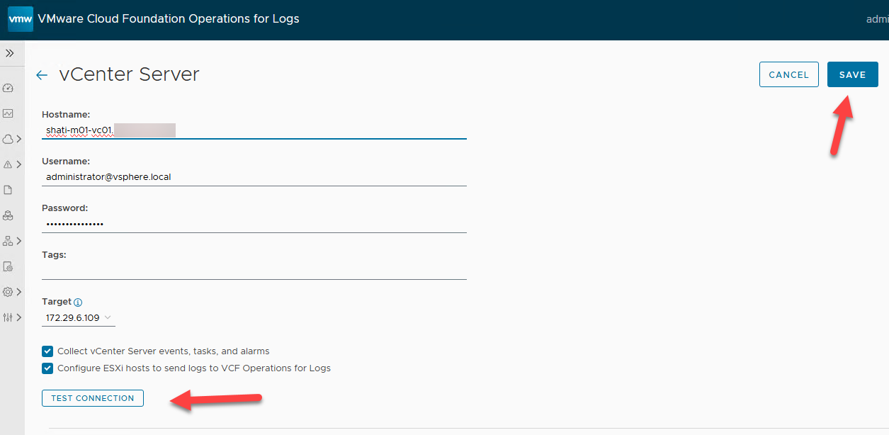

 Close the screen with the "\<-" in the upper left, then you should see
 something like this.

 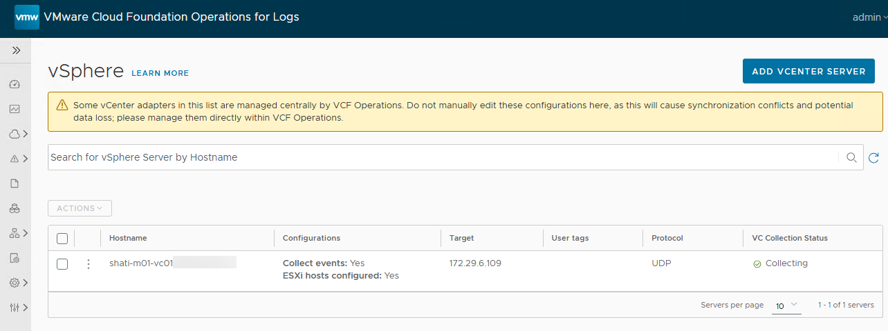

**Congratulations!**

**You have completed the basic deployment of VCF Operations for Logs!**
