# Prerequisites:

- Installed VCF Installer (latest version)

- Depot Configuration has been done

- Binaries are downloaded with status "Success"

- vCenter version at least 9.0.x

- Your virtual switch infrastructure is based on DVS

for more Information on Preparing to Deploy a new VMware Cloud
Foundation or vSphere Foundation Platform, please visit:

<https://techdocs.broadcom.com/us/en/vmware-cis/vcf/vcf-9-0-and-later/9-0/deployment/deploying-a-new-vmware-cloud-foundation-or-vmware-vsphere-foundation-private-cloud-/preparing-your-environment.html>

## 

# Start the migration process

- Connect to your VCF Installer appliance via https and provide the
  credentials.

 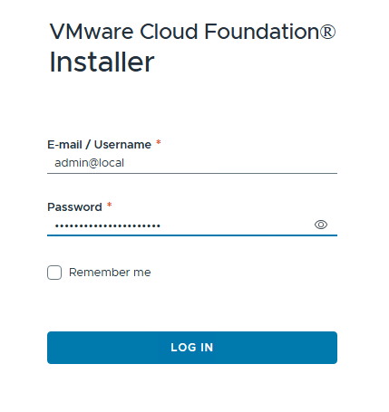

- After logging into VCF Installer, select "DEPLOYMENT WIZARD" to start
  the migration process.

 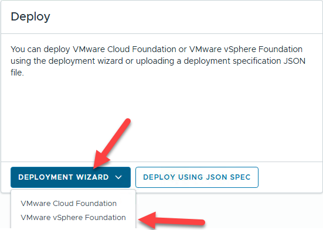

- To import an existing vCenter, opt in the checkbox next to "Use an
  existing vCenter as the management domain vCenter." and click "NEXT"

 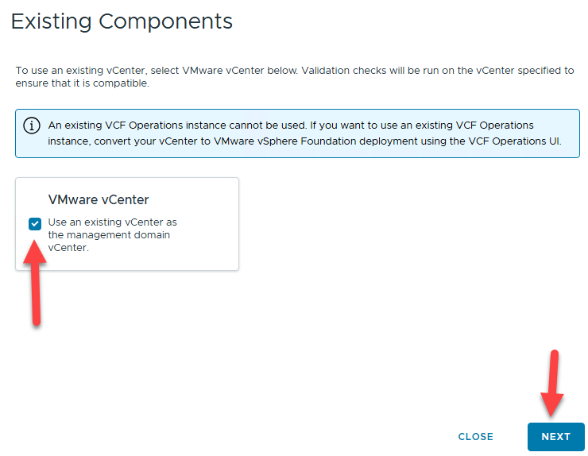

- Select the target version and proceed with "NEXT"

> Optionally, you can enable "Auto-generate passwords for newly
> installed appliances" or disable "Enable Customer Experience
> Improvement Program (CEIP)"
>
 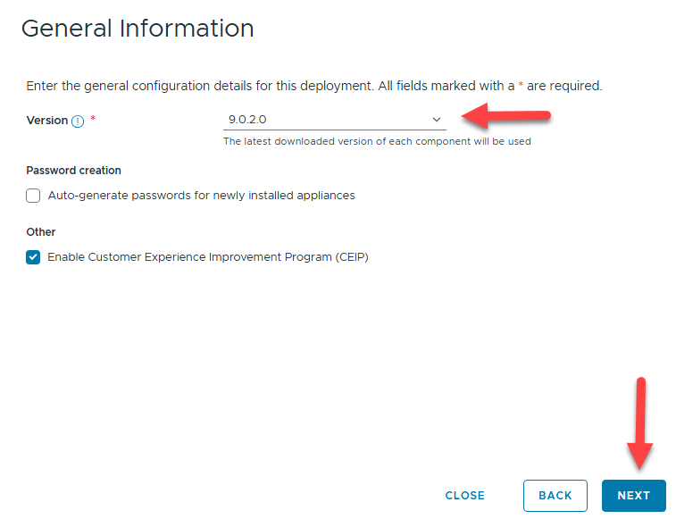

- VCF Operations is a core component for VVF and VCF, it is responsible
  for e.g. Licensing

  - Operations Appliance Size: Size of the appliance -- small is only
    recommended for lab environments!

  - Operations primary FQDN -e.g. when you will have more than 1
    appliance, specify the load balancer (VIP) name as FQDN

  - Administrator Password

  - Root Password

 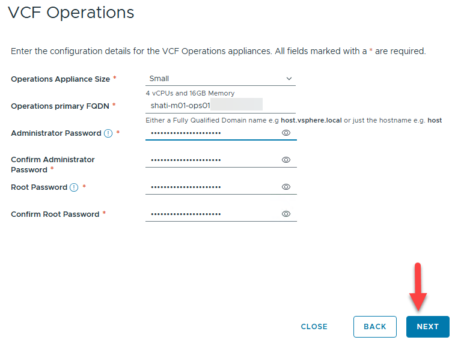

- Specify the current vCenter credentials for importing the existing
  vCenter into the VVF or VCF Environment, click "NEXT"

  - vCenter: FQDN of your existing vCenter appliance

  - Root Password: root password of your existing vCenter appliance

  - SSO user name: e.g. administrator@vsphere.local

  - SSO password: e.g. Password of your administrator@vsphere.local
    account

 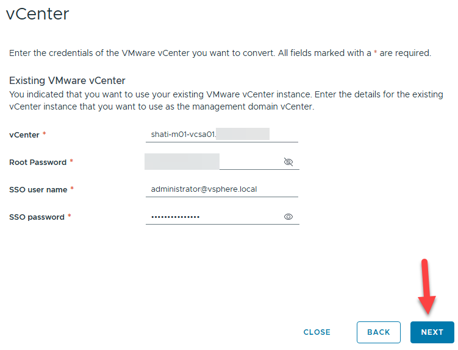

- You have to confirm the vCenter certificate to proceed.

 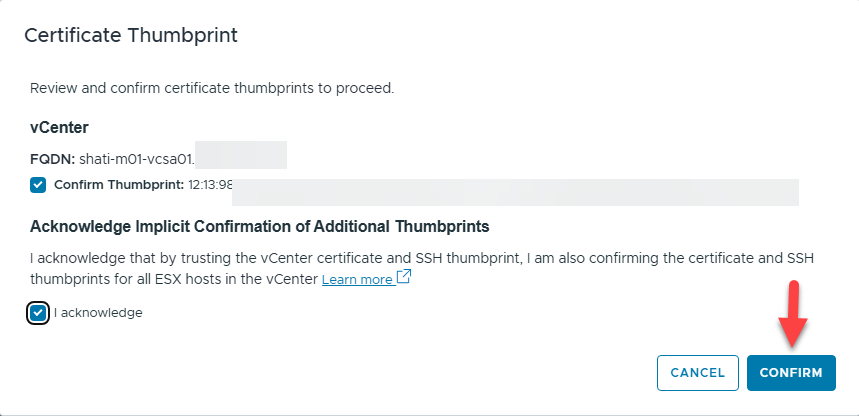

- Review the planned deployment or download the json spec.

  - Optional: You can download the json spec and edit with your
    preferred editor to modify values or options which are not present
    in the UI.

- You can then import the json spec at the very beginning to deploy your
  customized environment.

 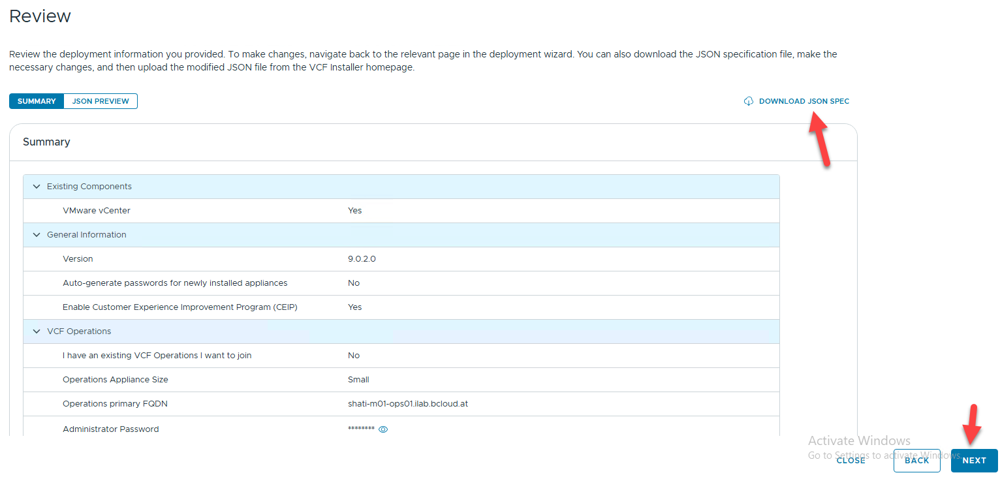

- The "Validate & Deploy" Stage checks all settings and validates the
  environment.

- Correct any error and analyze all warnings prior clicking "DEPLOY"
>
 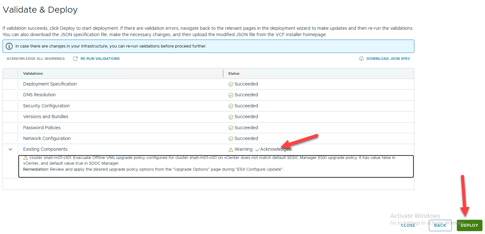

- You can monitor the deployment status within the VCF Installer UI.

> If any error occurs, consult the log file and correct the problem.
> After that, simply restart the deployment with the button on the upper
> right corner which will be visible in case of an error.
>
> But don\'t panic! This installation takes time! In my LAB environment
> I had to wait approx. 35 Minutes.
>
 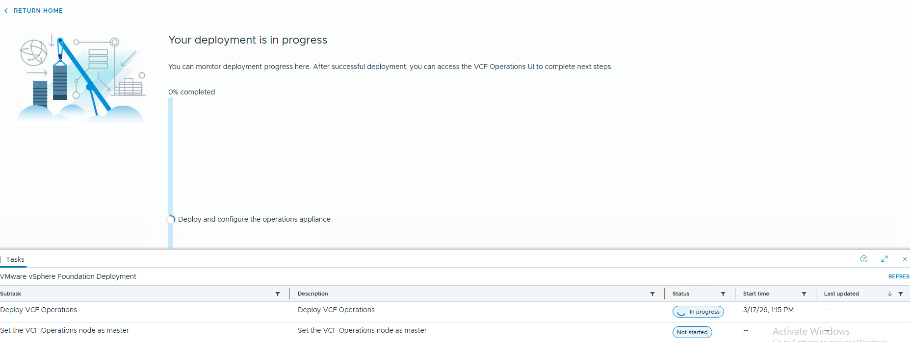

- When completed, follow the next steps regarding the licensing of the
  environment

 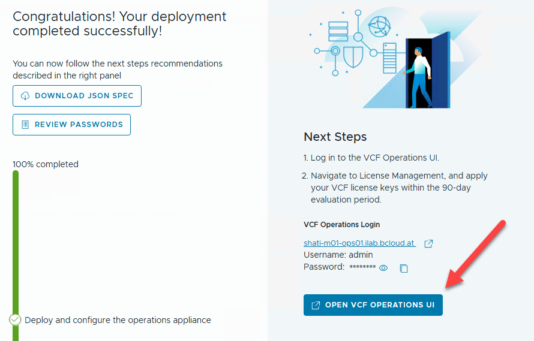

# Troubleshooting:

 ssh into your VCF Installer appliance and look at
 /var/log/vmware/vcf/domainmanager/domainmanager.log for any
 installation issues.

# Connect VCF Operations with vCenter

- Login into VCF Operations

 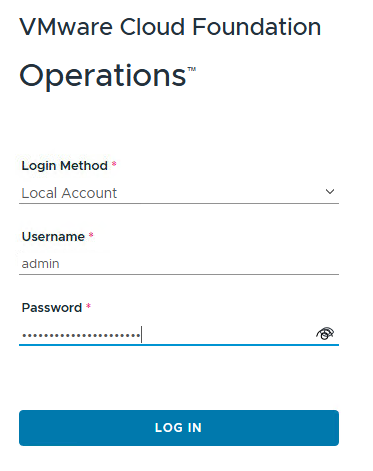

- Go to Administration -\> Integrations, select "ADD" and select
  "vCenter" as account type.

 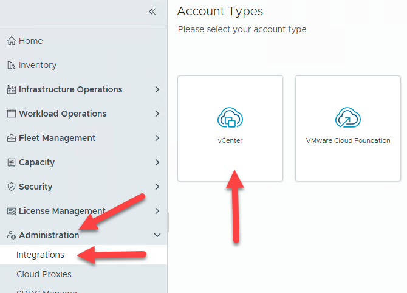

- Fill out all required fields and click "VALIDATE CONNECTION", on
  success, click "ADD"

 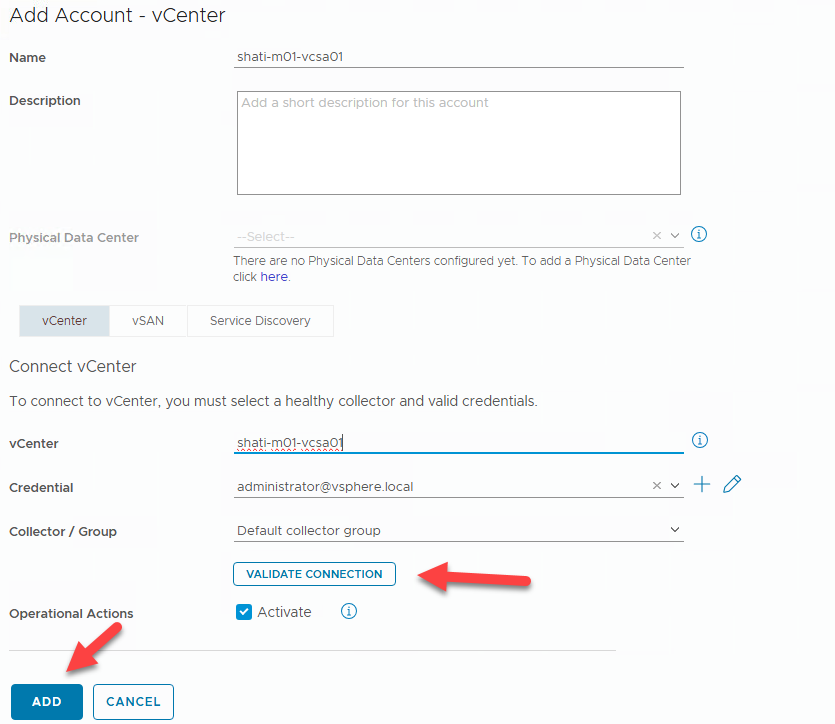

- Confirm this information.

 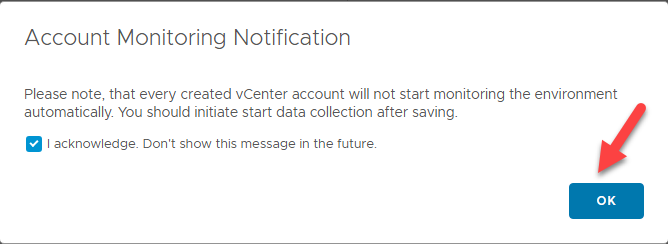

- Within the List of Integrations, expand the entry with status
  "Stopped" and click the three dots

 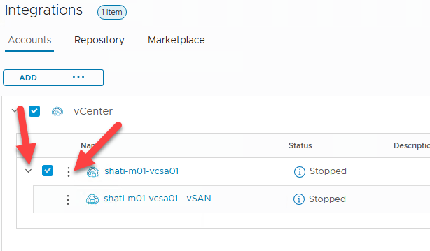

- Select "Start Collecting All" to enable metric collection

 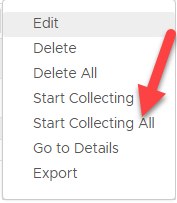

- Now, the Integration is displaying a warning, but this should
  disappear after a while.

 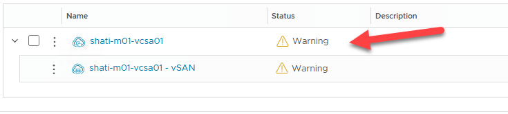

 After approx. 10 minutes, the status is green.

 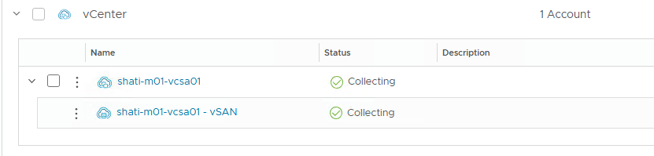

# Integrate VCF Operations for Logs with VCF Operations

> This step is optional but highly recommended!
>
> VCF Operations for Logs is a component where you can store your logs
> in a central place for troubleshooting.

- Navigate to "Infrastructure Operations" -\> "Analyze" and click
  "CONFIGURE OPERATIONS-LOGS APPLIANCE"

 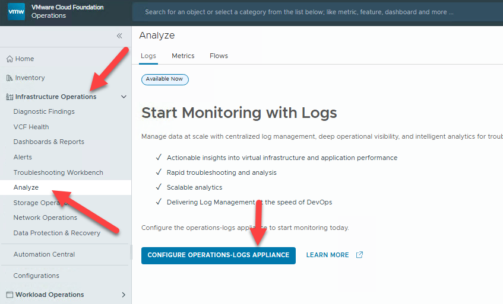

- On the "Operations-Logs Appliance Integration" provide the connection
 details for your manually deployed VCF Operations for Logs appliance
 and click "VALIDATE CONNECTION".

 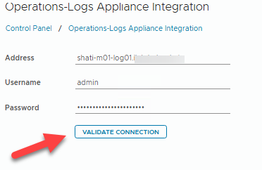

- Click "SAVE" when the connection test was successful.

- Check the integration -- Navigate to "Infrastructure Operations" -\>
  "Analyze" and see, if your syslog Information is displayed.

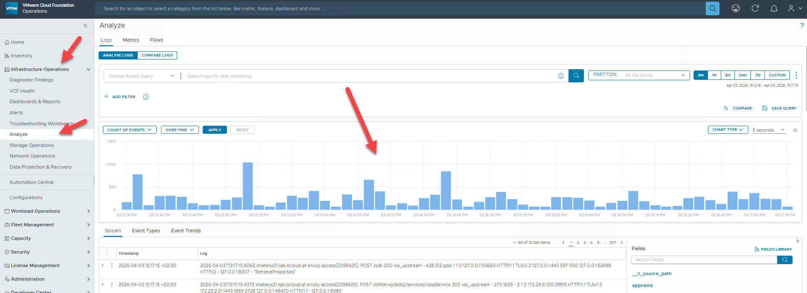

**Congratulations!**

**You have completed the basic VVF 9.0.2 deployment!**
